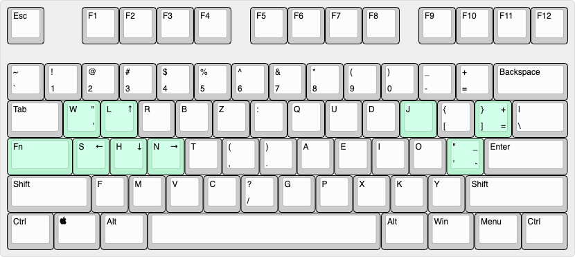

# Josh's Custom Keyboard Layout

Karabiner, Koolertron, and Anne Pro 2 configurations for modifications to the [Halmak layout](https://github.com/MadRabbit/halmak) that I use.

I used Dvorak for one year before switching to Colemak. There are some Dvorak mappings that I like for programming, so I modded my layout to include them. I then switched to Halmak in 2019, and have used it for over a year - and love it. Here is an article I wrote about it: "[In Search of the Ultimate Keyboard Layout](https://joshwulf.com/blog/2019/11/ultimate-keyboard/)".

In these layouts, semicolon and colon are reversed, and parens and angle brackets are switched:

_Image created using [keyboard-layout-editor.com](http://www.keyboard-layout-editor.com/)_.

## Koolertron Setup

The `Koolertron` directory contains the layouts for the left and right-hand sides of a [Koolertron AE-SMKD62](https://www.amazon.com/Koolertron-Programmable-Mechanical-Keyboard-Ergonomic/dp/B07PZT3Z25).

You need to get a [Windows image](https://developer.microsoft.com/en-us/windows/downloads/virtual-machines/) for VirtualBox or Parallels, and then get the configuration utility for the Koolertron from [here](https://amazonfiles.s3.amazonaws.com/smkd62.rar).

## Mac Setup

In Keyboard, make sure Capslock is mapped to Capslock. We will override it with Karabiner.

## Anne Pro 2 Setup

1. Open ObinsKit.
2. Import `AnnePro2/AnnePro2.json`.
3. Set System Keyboard to a standard QWERTY layout.

## Karabiner Setup

1. Install [Karabiner](https://pqrs.org/osx/karabiner/index.html).
2. In Simple Modifications, map `caps_lock` to `fn`
3. `mkdir -p ~/.config/karabiner/assets/complex_modifications`
4. `cp Karabiner/* ~/.config/karabiner/assets/complex_modifications/`
5. Open Karabiner. Go to "Complex Modifications", click "Add rule".
6. Add the rules you want.
